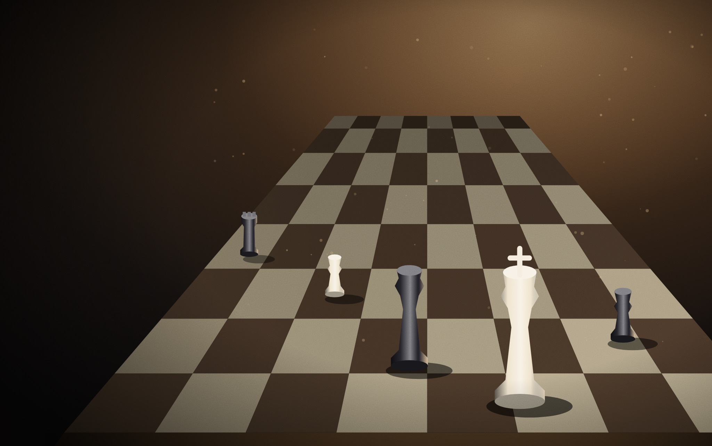
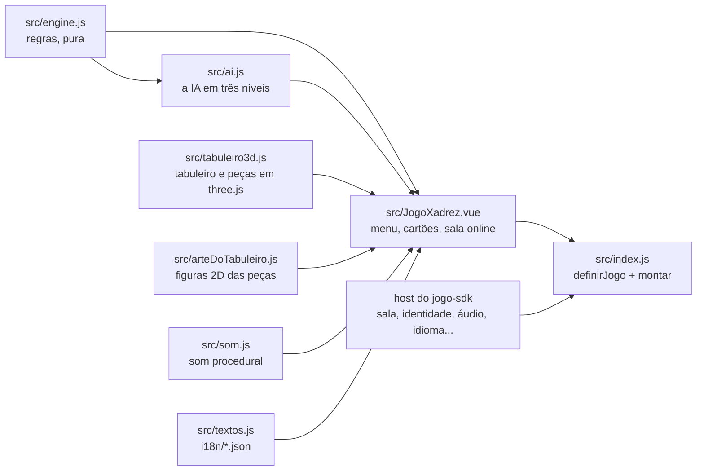

# Xadrez

O Xadrez do [RoqueOS](https://roqueos.com.br): tabuleiro 3D de madeira, peças torneadas, regras
completas. Jogue contra a IA em três níveis, com alguém no mesmo aparelho, ou online, mandando o
código ou o QR da sala. Jogue em [roqueos.com.br/jogar/xadrez](https://roqueos.com.br/jogar/xadrez).

_English below._

## Por que existe

Até 25/09/2026 este jogo morava dentro do repositório do RoqueOS e importava as stores do
sistema e o Firebase da partida online direto. Agora ele é um repo próprio na organização
[roqueos-games](https://github.com/roqueos-games), aberto, e fala com o RoqueOS só pelo
[`jogo-sdk`](https://github.com/roqueos-games/jogo-sdk). O mesmo código roda no RoqueOS, sozinho
no seu navegador (`yarn dev`) e no teste.

## Como se joga

| Ação              | Como                                                                          |
| ----------------- | ----------------------------------------------------------------------------- |
| mover             | toque na peça (as casas legais acendem) e depois na casa                      |
| promover          | o peão que chega na última fileira abre a escolha: dama, torre, bispo, cavalo |
| girar o tabuleiro | arraste com um dedo (ou o mouse)                                              |
| zoom              | pinça com dois dedos, ou a roda do mouse                                      |
| voltar ao menu    | o **×** no cartão de cima                                                     |

As regras: todos os lances legais, roque, en passant, promoção, xeque, xeque-mate e afogamento
(empate). Não há relógio, nem empate por repetição ou pela regra dos 50 lances.

## Arquitetura

- `src/engine.js` é a regra, sem Vue e sem DOM: geração de lances legais, roque, en passant,
  promoção, xeque, mate e afogamento, e o `serialize`/`deserialize` do tabuleiro, que é o que
  atravessa a sala online.
- `src/ai.js` escolhe o lance da IA por busca (negamax com poda alfa-beta) no próprio motor; o
  nível decide a profundidade e a chance de um lance ao acaso, para o Fácil ser vencível.
- `src/tabuleiro3d.js` desenha o tabuleiro e as peças com [three.js](https://threejs.org), tudo
  procedural: peças torneadas por perfil, cavalo extrudado, texturas de madeira em canvas. Cuida
  do toque (qual casa foi tocada), do giro e do zoom da câmera e da animação do lance. No perfil
  leve nasce sem antialias, sem sombra, com peças de menos segmentos e pixel ratio menor. É o
  mesmo arquivo que as Damas usam, e cada repo leva a sua cópia.
- `src/arteDoTabuleiro.js` desenha em canvas 2D as figuras das peças que aparecem nos cartões,
  no menu e na escolha da promoção. Traz também o tabuleiro 2D e os discos das Damas, que o
  Xadrez 3D não usa: o arquivo veio inteiro, sem mudança, como no RoqueOS.
- `src/JogoXadrez.vue` é a tela: menu, escolha de lado e nível, cartões dos jogadores com as
  peças tomadas, espera com QR, entrada por código, promoção e fim de partida. Tudo o que vem do
  sistema (a sala online, o nome do jogador, áudio, perfil de aparelho fraco, métrica, aviso,
  idioma) chega pelo `host`.
- `src/index.js` cria um app Vue próprio dentro do elemento que o host entrega e devolve
  `{ ativar, desmontar }`. Desmontar solta os relógios, para de observar a sala e descarta o
  renderer e as texturas.
- `jogo.json` é o manifesto: nome e descrição nos dez idiomas, SEO, etiquetas, capa, ícone,
  tamanho de janela, `aceitaConvite` e a capacidade `sala`. O RoqueOS confere que ele bate com
  o catálogo.

O Xadrez não guarda nada: nem recorde, nem placar na conta (`recorde: null` no manifesto). O
`three` e o `qrcode` são `peerDependencies`: o RoqueOS fornece os dele, e o jogo não traz
outros. As versões exatas em `devDependencies` são as mesmas que o RoqueOS instala, para o teste
e o `yarn dev` verem o que o jogador vê.

## Partida online

A sala é do host, pela capacidade `sala` do SDK: o jogo cria (`criar`), entra (`entrar`),
observa (`observar`) e manda o lance (`jogar`), e não fala com banco nenhum. Quem cria joga de
brancas; quem entra, de pretas. Sem conta não há sala: o host recusa, e o jogo avisa "Entre na
sua conta para jogar online".

O que atravessa a sala é o de antes da extração, de propósito, porque do outro lado pode estar
um RoqueOS antigo, aberto durante o deploy: o `estado` é o `serialize` do motor (as oito
fileiras, a vez, o roque e o en passant, num texto só) e a `vez` é `'w'` ou `'b'`.

No `yarn dev`, o host de desenvolvimento do SDK faz a sala entre duas abas do mesmo navegador,
pelo `localStorage`: crie a partida numa aba e abra o link (a própria página com
`?sala=<código>`) numa aba nova. Não duplique a aba, que vira o mesmo jogador.

### Limitações conhecidas

- O convite (o link ou o QR) é lido uma vez, quando o jogo abre. Um segundo convite com a
  janela do Xadrez já aberta não chega ao jogo; feche e abra de novo. Antes da extração o
  RoqueOS passava o convite por uma prop que mudava com a janela aberta.
- Quando o anfitrião cai (fecha a aba), a sala marca `anfitriaoSaiu`, e o convidado não fica
  sabendo: a partida só termina para ele quando a sala é encerrada ou some. Era assim antes.
- Sair da partida pelo **×** para de observar a sala, mas não a encerra para o outro lado. Era
  assim antes.

## Pré-requisitos

- Node 24 (o `.nvmrc` diz), ou 22 no mínimo.
- Yarn 1.22.

## Como rodar

1. `yarn install --ignore-scripts`
2. `yarn dev` e abra o endereço que o Vite mostrar: o jogo roda com o host de desenvolvimento
   do SDK.
3. `yarn verificar` antes de abrir PR: lint, formato, testes e o `jogo check`, o mesmo que o CI
   roda.

O teste roda no jsdom, que não tem WebGL: o `three` é trocado por um dublê
(`test/threeStub.js`). Verde no teste não diz nada sobre o desenho na GPU. Mudança no código
que toca a GPU (`src/tabuleiro3d.js`: renderer, materiais, luzes, sombras, texturas, pixel
ratio, perfil leve) precisa ser vista num iPhone de verdade antes de subir.

## Estrutura

| Caminho              | O que é                                                                |
| -------------------- | ---------------------------------------------------------------------- |
| `src/`               | o jogo (regra, IA, tabuleiro 3D, arte 2D, tela, som, textos, entrada)  |
| `i18n/`              | um JSON por idioma, com as mesmas chaves nos dez                       |
| `public/`            | capa e ícone; a origem de cada arquivo está no [ASSETS.md](ASSETS.md)  |
| `test/`              | testes com o host falso do SDK e o dublê do three, sem nada do RoqueOS |
| `dev/`, `index.html` | o jogo sozinho no navegador, para desenvolver                          |
| `jogo.json`          | o manifesto que o RoqueOS lê                                           |

## Onde ele se encaixa

O RoqueOS instala este repo por uma tag exata e monta o jogo pelo `mount` do SDK, na janela, em
`/jogar/xadrez` e no modo TV. Uma mudança aqui só chega ao RoqueOS quando uma tag nova é pinada
lá, depois de revisada. Os nomes de evento (`game_start`, com `mode` `local`, `ai`,
`online-host` ou `online-guest` e, contra a IA, `level`; e `game_over`, com `result`, `mode` e
`level`) não mudam: o histórico de uso depende deles. O gancho `window.__chess`, que só existe
em modo E2E, é o que o QA e a captura de capa do RoqueOS usam.

## Licença

MIT, no código e na arte própria. Veja [LICENSE](LICENSE) e [ASSETS.md](ASSETS.md).

---

## English

Chess from [RoqueOS](https://roqueos.com.br): a 3D wooden board, turned pieces, the full rule
set. Play the AI on three levels, a friend on the same device, or online by sharing the room
code or QR. It talks to RoqueOS only through the
[`jogo-sdk`](https://github.com/roqueos-games/jogo-sdk), so the same code runs inside RoqueOS,
standalone in your browser and in tests.

- `yarn install --ignore-scripts`, then `yarn dev` to play it locally. Online play works between
  two tabs of the same browser: create a room in one tab and open its link in a new tab.
- `yarn verificar` runs lint, formatting, tests and `jogo check`, exactly like CI.
- Online rooms come from the host (`sala` capability); the game never talks to a database. The
  board state that crosses the room keeps its pre-extraction format on purpose.
- Known limitation: the invite link is read once, when the game opens; a second invite while
  the window is already open does not reach the game.
- Tests run in jsdom with a `three` stub; they say nothing about the GPU. Changes to
  `src/tabuleiro3d.js` need to be checked on a real iPhone.
- Code and comments are in Brazilian Portuguese; issues and pull requests in English are
  welcome.
- Event names (`game_start`, `game_over`) are stable on purpose: analytics history depends on
  them. The game stores nothing locally or in the player's account.

MIT licensed, code and original art.
